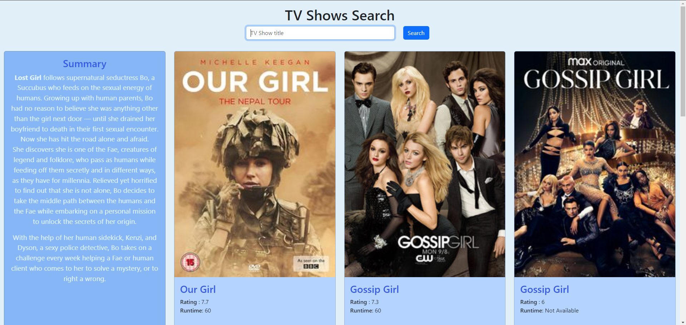

# TV Shows Search



## Project Overview
TV Shows Search is a web application that allows users to search for TV shows and view details including ratings, runtime, and summaries. It features a user-friendly interface with a responsive design that adapts to various screen sizes.

## Features
- Search functionality for TV show titles.
- Responsive design for various screen sizes.
- Flip animation for TV show cards to reveal summaries.
- Integration with the TVMaze API to fetch show details.

## Technologies Used
- HTML5
- CSS3
- JavaScript
- Bootstrap 5.3.2
- Axios 1.1.2
- TVMaze API

## Setup and Installation
To set up this project locally, follow these steps:

1. Clone the repository:
```sh
git clone https://github.com/yourusername/tv-shows-search.git
```

2. Navigate to the project directory:
```sh
cd tv-shows-search
```

3. Open the `index.html` file in your browser or set up a local server to start the application.

## How to Use
1. Enter a TV show title into the search bar.
2. Click the 'Search' button to retrieve show details.
3. Hover over a show card to see the summary on the back.

## Contributing
Contributions are welcome! If you'd like to contribute, please follow these steps:

1. Fork the repository.
2. Create a new branch: `git checkout -b my-new-feature`
3. Make your changes and commit them: `git commit -am 'Add some feature'`
4. Push to the branch: `git push origin my-new-feature`
5. Submit a pull request.

## Acknowledgments
- This project uses [Bootstrap](https://getbootstrap.com/) for the front-end framework and [Axios](https://github.com/axios/axios) for API requests.
