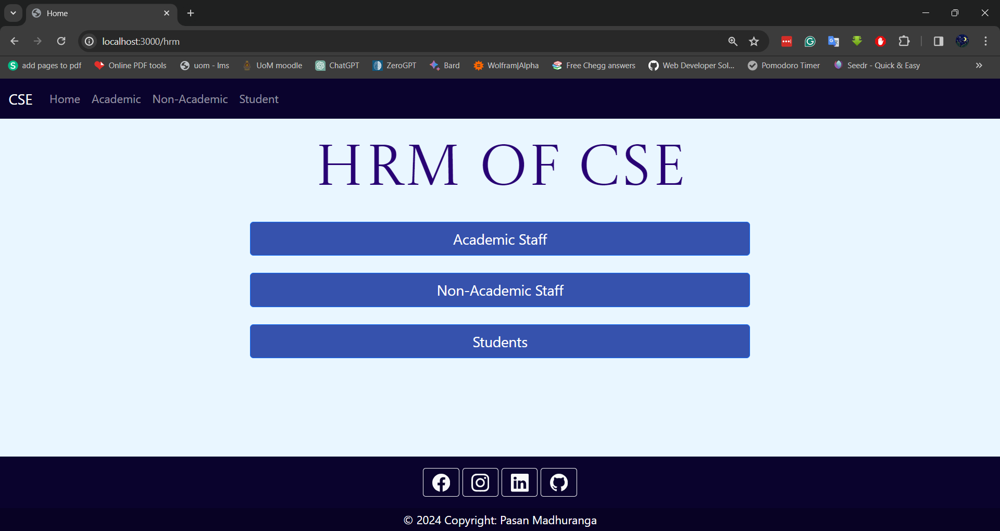
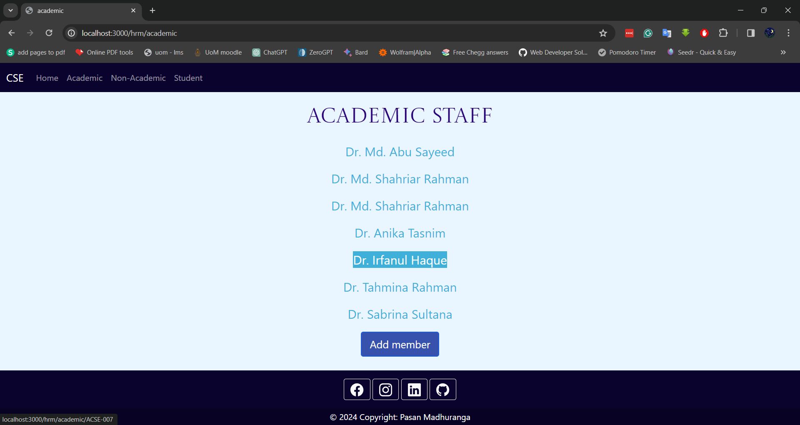
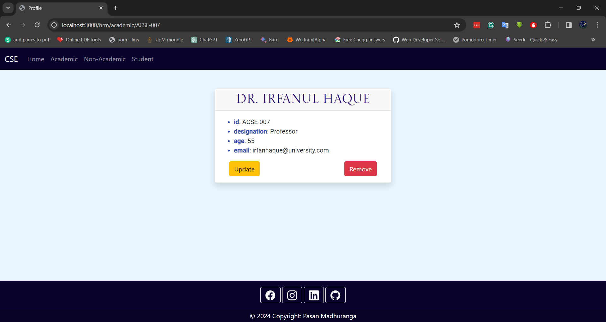
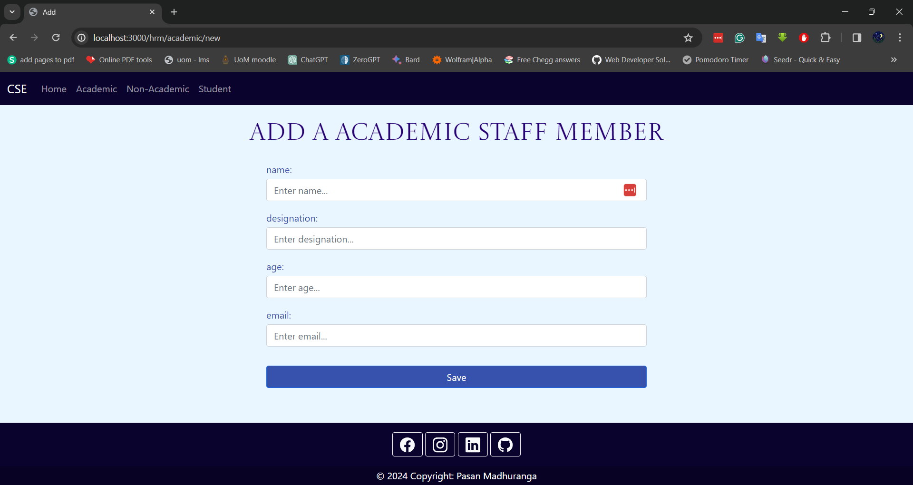
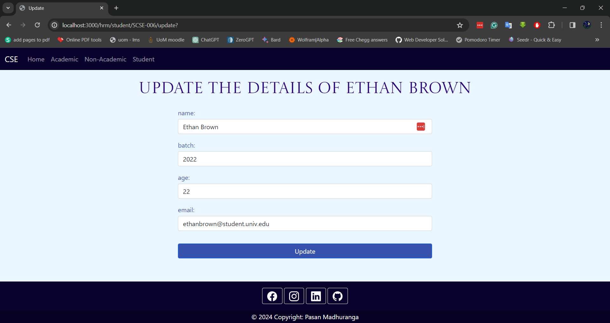

# CSE Department HRM Web Application

This project is a simple HRM (Human Resource Management) system for the Computer Science and Engineering (CSE) department to manage and display details of academic staff, non-academic staff, and students. It allows users to perform CRUD (Create, Read, Update, Delete) operations on member information using an Express.js server.

## Features

- View lists of academic and non-academic staff, and students.
- Add new members to each category.
- Update details of existing members.
- Remove members from the system.
- View detailed profiles of each member.

## Technologies Used

- Node.js
- Express.js
- EJS for templating
- Method-override for using HTTP verbs such as PUT or DELETE

## Installation

To set up this project locally, follow these steps:

1. Clone this repository.
2. Navigate to the project directory.
3. Run `npm install` to install the necessary dependencies.
4. Start the server with `npm start` or `node index.js`.
5. Visit `http://localhost:3000/hrm` in your web browser to access the application.

## Usage

### Home Page

The home page presents the main categories of the department: Academic Staff, Non-Academic Staff, and Students.

### Viewing Members

Select a category to view the list of members. Each member's name is displayed along with options to view their profile, update their details, or remove them from the system.

### Viewing a Member's Profile

Click on a member's name to view their detailed profile, including their ID, designation, age, and email.

### Adding a New Member

Click on the "Add Member" button to open a form where you can enter the new member's details and save them to the system.

### Updating Member Details

From a member's profile, click "Update" to edit their details. The update form allows you to change the member's name, batch (if a student), age, and email.

## Contributing

Contributions to the project are welcome! Please follow these steps:

1. Fork the repository.
2. Create a new branch for your feature.
3. Add your changes and commit them.
4. Push to your branch.
5. Create a new Pull Request.

